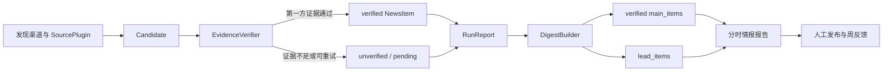
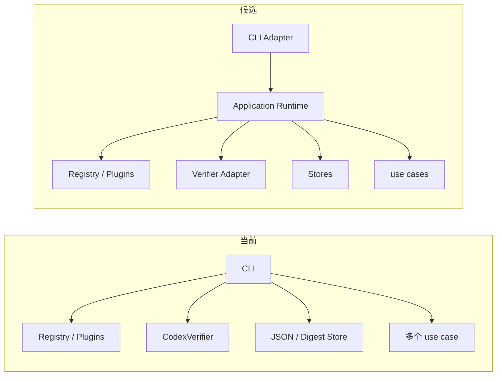
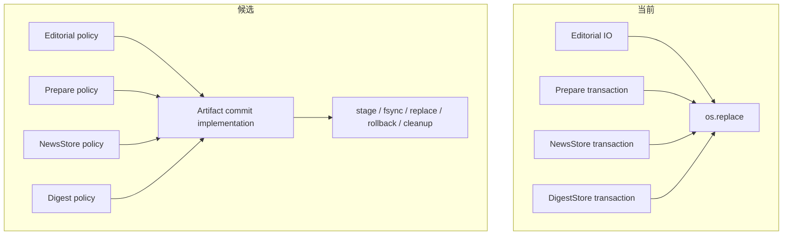
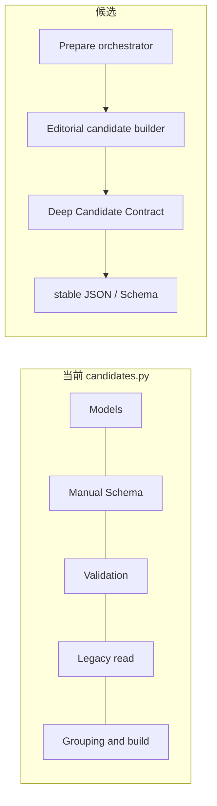
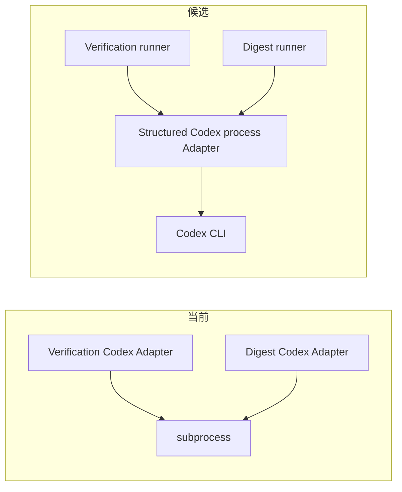
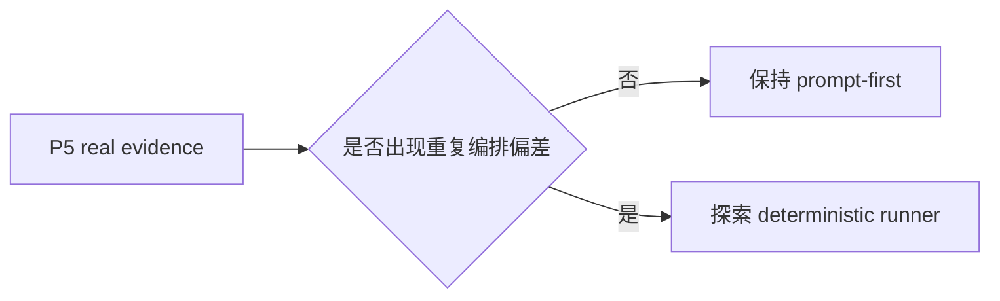
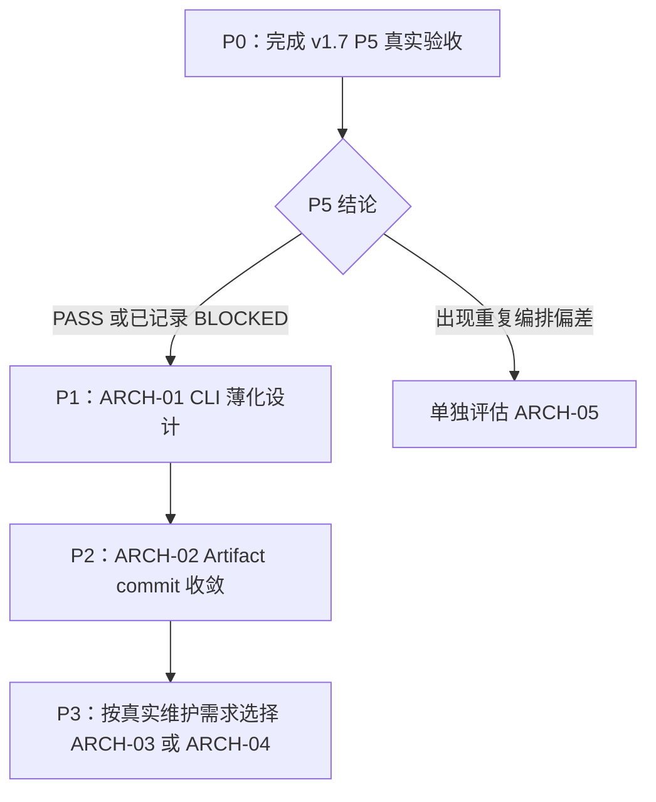

# mynews 仓库设计整理与后续架构方向审查

## 文档定位

本文基于本地 `main` 提交 `d1f166d` 的源码、权威文档、四份已接受 ADR 和 v1.7 当前计划，整理
当前设计、实际代码形态、已发现问题和候选解决方向。

本文是 **Draft / Proposed** 的设计审查快照，不替代以下权威真相：

- 当前实施顺序仍以 [v1.7 当前计划](../planning/v1.7-intelligence-loop-plan.md) 为准；
- 已实现结构仍以 [系统架构](system-architecture.md) 为准；
- 证据、Digest 和外部插件边界仍由 [ADR-0001 至 ADR-0004](../decisions/README.md) 约束；
- 本文中的候选方向在单独确认、设计、实施和验收前，不能写成 Implemented。

本轮只做静态设计审查，没有执行真实网络、Codex 分时任务或调度验收。因此 v1.7 P5 仍是
`BLOCKED`，本文不把任何真实能力上调为 Verified。

## 审查口径

本轮不以“文件长”或“代码多”直接判定架构问题，而使用以下标准：

1. **Depth**：一个 module 是否通过较小、稳定的 interface 隐藏足够多的实现复杂度；
2. **Leverage**：一处改动是否能让多个调用方同时受益；
3. **Locality**：完成一项常见变更需要理解和修改多少处代码；
4. **Deletion test**：新的 module 能否替代并删除既有重复实现，而不是只增加一层包装；
5. **ADR 一致性**：方案是否保持第一方证据、事实/线索隔离、事务恢复和显式插件加载等既定决定。

## 当前设计与产品方向

### 一条主线：从发现线索到可审计情报

项目方向不是“尽量多抓新闻”，而是把发现、核验、情报整理和人工反馈串成一条可追溯链路：

- 发现渠道只扩大候选覆盖，不提升事实状态；
- 程序校验第一方 URL、边界、正文摘录、日期和哈希，Codex 不是信任根；
- RunReport 保存事实与失败，Digest 只消费已保存结果；
- 正式情报只来自 verified 主榜，线索始终与事实隔离；
- 自动任务只生成报告和状态，不自动发布；publication 与 feedback 只记录人工事实。

### 当前四层结构

| 层次 | 当前 module | 主要责任 | 稳定输出或状态 |
| --- | --- | --- | --- |
| 发现层 | `sources`、`SourceRegistry`、外部 SourcePlugin | 获取候选、隔离来源失败、报告健康 | Candidate、SourceHealth |
| 信任层 | `normalization`、`deduplication`、`verification` | 相关性、去重、受控解析、pending 和证据生命周期 | RunReport、dedup、pending |
| 情报层 | `candidates`、`prepare`、`digest` | 编辑候选包、保守聚合、排序、摘要和事实/线索隔离 | Candidate Contract、Digest |
| 运行层 | `cli`、Stores、`news-task.md`、`automation` | 命令入口、文件提交、分时任务契约和人工回填 | output、state、logs |

### 已形成的真实 seam

下列 interface 已有至少一个替代实现或测试替身，继续保留：

- `SourcePlugin`：内置 Adapter、外部分发包 Adapter 和 fixture；
- `EvidenceVerifier` / `DigestSummaryRunner`：生产 Codex 路径与离线 fake/回退路径；
- `NewsStore`：文件系统实现与内存测试替身；
- `Clock`、HTTP client：生产实现与确定性测试替身。

文件拆分本身不等于 seam。只有确有生产实现和替代实现，或需要隔离外部 I/O 时，才新增公共
interface；其余候选优先做内部深 module，不扩大公共 surface。

## 应保留、不重新争论的设计

### 1. 第一方证据是唯一 verified 门槛

ADR-0001 和 ADR-0002 已将 discovery 与 proof 分离，程序拥有最终校验权。任何后续重构都不得
让 Candidate、搜索摘要、媒体转载、模型输出或热度信号进入 verified 主榜。

### 2. 新闻去重与核验重试是两套生命周期

DedupState 解决重复新闻输出，PendingVerificationState 解决证据暂时失败后的跨运行重试。两者
不能为了减少状态文件而重新合并。

### 3. Digest 是只读派生结果

DigestBuilder 只读取 RunReport 和上一期 Digest，不重新采集、不推进核验、不修改 pending。
`main_items` 与 `lead_items` 的隔离必须由模型和程序共同守住。

### 4. 外部插件显式加载且只负责来源

外部包继续通过 `mynews.source_plugins` 接入；普通运行不自动加载，loader 不向插件开放 Store、
Verifier 或 Codex。插件是受信任本地代码，不承诺进程级沙箱。

### 5. 失败不得污染 latest 或成功档位

RunReport、Digest 和自动化报告都必须保留历史、原子提交并在失败时恢复旧状态。真实 P5 还要
证明报告先于状态、失败恢复和无 `.tmp` 残留。

## 发现的问题与候选解决方向

### 总览

| ID | 问题 | 证据 | 影响 | 建议强度 | 建议时机 |
| --- | --- | --- | --- | --- | --- |
| ARCH-01 | CLI 越过应用层直接装配来源、Store 和 Codex | `cli.py:13-32, 692-916` | 文档与实现不一致；新增命令继续扩大入口复杂度 | Strong | P5 收口后第一项 |
| ARCH-02 | 原子提交机制在至少七处重复 | `editorial_io.py`、report/watchlist/validation、`prepare.py`、两个 Store | 恢复语义和格式策略易漂移，故障测试重复 | Strong | ARCH-01 后或同一阶段 |
| ARCH-03 | Candidate 契约定义、Schema、语义校验和构建算法集中 | `candidates.py:77-929` | 契约修改需要同时理解多种职责，漂移风险高 | Worth exploring | 前两项稳定后 |
| ARCH-04 | 核验与 Digest 重复实现 Codex CLI 进程 Adapter | `verification/codex.py:88-162`、`digest.py:97-195` | 进程安全参数和错误映射需要双处维护 | Worth exploring | 下次 Codex CLI 变化前 |
| ARCH-05 | 分时运行仍主要由提示契约驱动 | `news-task.md`、`automation.py` | latest-only、档位选择和五步顺序缺少独立确定性 runner | Speculative | P5 产生真实证据后 |

> 行号是提交 `d1f166d` 的审查证据，后续代码变化时必须重新定位，不能把本表当作永久位置。

### ARCH-01：把 CLI 恢复为薄 Adapter

**现状与证据**

[系统架构](system-architecture.md) 明确写有“CLI 只调用应用层，不编排来源、Codex 或文件写入”。
实际 `src/mynews/cli.py` 直接导入 `ExternalPluginLoader`、`SourceRegistry`、`DigestFileStore`、
`JsonNewsStore` 和 `CodexVerifier`，并在 `main` 内完成：

- built-in registry 和外部插件的选择、合并与错误输出；
- `SourceCollector`、`PipelineCollector`、`CodexVerifier` 和 Store 的装配；
- Digest 配置、上一期读取、构建和三文件提交；
- 各命令的异常映射、JSON 输出和退出码判断。

`main` 目前约 227 行，`build_parser` 约 257 行。长度不是根因；根因是 CLI Adapter 同时暴露了
参数语法、运行时装配和 use case 编排三类变化。

**为什么值得优先处理**

- 新增或调整命令时，需要同时理解来源、插件、Store、Codex 和退出码；locality 较差；
- CLI 测试容易被迫依赖具体文件 Store 或对内部装配做特殊分支；
- 当前代码形态与权威架构目标不一致，继续增加功能会放大漂移；
- 将装配下沉后，普通 Python 调用和未来任务 runner 可以复用同一应用入口，leverage 高。

**候选方向**

在应用层形成一个深的运行时入口，内部拥有来源选择、依赖装配、use case 调用和结构化结果；
CLI 只保留参数解析、中文展示和退出码适配。暂不冻结类名、方法签名或结果对象，待单独设计时
比较至少两种 interface 方案。

**Deletion test**

方案只有在能够删除 `cli.py` 中具体 Store、Codex 和插件装配分支，并让 CLI 测试只观察命令
输入输出时才算成立。只在 `main` 外再包一层而保留原装配，不算改善。

**ADR 检查**

不改变 SourcePlugin、EvidenceVerifier、NewsStore 或 JSON interface；只是把已有装配移回应用层，
与 ADR-0001、ADR-0004 一致。若设计要求改变插件加载语义，则必须停止并单独更新 ADR。

### ARCH-02：统一文件提交机制，保留不同业务策略

**现状与证据**

仓库目前至少有七处同目录暂存、`fsync`、`os.replace` 和清理逻辑：

1. `application/editorial_io.py`：单文件文本/JSON 原子替换；
2. `application/report.py`、`watchlist.py` 和 `validation.py`：分别复制单文件原子替换；
3. `application/prepare.py:_write_transaction`：Candidate 包多文件暂存与替换；
4. `storage/json_store.py:_transactional_write_json`：RunReport、latest、dedup、pending 的多文件回滚；
5. `storage/digest_store.py:_transactional_write`：Digest 历史与两个 latest 的多文件回滚。

它们的业务策略并不完全相同：单文件写入不需要批次回滚，NewsStore 和 DigestStore 需要恢复旧
内容，自动化输出还要求“报告成功后才写状态”。问题不是都用 `os.replace`，而是底层暂存、恢复、
清理和错误分类重复实现，策略差异散落在每个调用方。

**候选方向**

建立一个内部的 artifact commit module，统一字节暂存、目录内替换、回滚和临时文件清理；
NewsStore、DigestStore、Prepare 和自动化输出只保留各自提交顺序与业务错误。它首先是内部深
module，不必为了“可扩展”引入新的公共 interface 或生产依赖。

**收益与风险**

- 一处故障注入可覆盖所有文件提交方，leverage 高；
- `.tmp` 清理、旧文件恢复和错误分级集中，locality 提升；
- 风险是错误地把“批次原子恢复”与“报告先于状态”合成同一种语义；设计必须保留策略差异；
- 不引入数据库，不承诺跨文件系统或断电级真正原子事务。

**Deletion test**

新实现必须删除上述 module 中重复的暂存与回滚私有函数，并让现有失败恢复测试继续成立。
若 Report、Watchlist 或 Schema 仍保留自己的 `NamedTemporaryFile`/`os.replace` 路径，也未通过
deletion test。

**ADR 检查**

该方向强化 ADR-0002、ADR-0003 的事务后果，不改变提交集合和 latest 推进条件。若无法证明失败
恢复等价，则不实施。

### ARCH-03：让 Candidate Contract 成为深 module

**现状与证据**

`application/candidates.py` 约 929 行，同时包含：

- Pydantic 契约模型；
- 手写 Draft 2020-12 JSON Schema；
- 结构校验与跨字段语义校验；
- 旧格式读取兼容；
- 候选聚类、来源族归一、观察历史和 publication 匹配；
- 输出安全检查和 payload 构建。

其中 `candidate_contract_schema`、`validate_candidate_payload`、`_read_legacy_payload` 和
`build_candidate_payload` 分别约 193、106、64 和 110 行。风险不是函数数量，而是“外部契约
如何定义”与“候选如何生成”需要同步理解；Pydantic 结构与手写 Schema 也存在随字段变化漂移的
可能。当前测试通过不代表未来变更不会遗漏其中一份定义。

**候选方向**

以稳定 Candidate Contract v1 为外部 interface，把契约定义、Schema 导出、读取兼容和语义
校验收进一个深 module；候选聚类和 editorial payload 构建作为独立内部算法调用该契约。
输出 JSON、Schema 文件和 CLI 行为保持不变。

**推荐强度为何不是 Strong**

Candidate Contract 已有严格测试且属于 v1.6 刚完成的稳定能力。没有真实缺陷时，先完成 P5 和
两个高 leverage 候选更稳妥；该项应在出现 Candidate v1 维护需求时以小步兼容测试推动。

**Deletion test 与 ADR 检查**

设计必须消除契约定义的重复真相，而不是把同一份手写 Schema 移到新文件。它不得改变
Candidate 只能作为线索的事实边界，也不得降低 `extra=forbid`、HTTPS、数量限制或隐私门禁。

### ARCH-04：合并重复的 Codex CLI 进程 Adapter

**现状与证据**

核验路径的 `verification/codex.py:88-162` 与 Digest 路径的
`application/digest.py:97-195` 分别管理临时目录、输出 Schema、只读 sandbox、reasoning effort、
超时、返回码和输出文件读取。两套测试也分别 monkeypatch 各自 module 的 `subprocess.run`，重复
检查相同的 Codex CLI 安全参数。

两个领域需要不同 prompt、响应模型、错误文案和程序复核；这些差异应保留。重复的是短生命周期
结构化进程执行机制。Codex CLI 参数或进程行为变化时，目前必须修改并验证两套 Adapter。

**候选方向**

共享一个只负责结构化 Codex 进程执行的内部 infrastructure Adapter，集中拥有临时目录、CLI
flags、Schema 文件、超时和基础错误分类。核验与 Digest 继续拥有各自的 runner interface、prompt、
响应模型、证据复核和安全回退，不把两种领域结果合成一种 Schema。

**Deletion test 与 ADR 检查**

核验和 Digest module 中的 subprocess、临时目录和共同 CLI 参数构建必须删除；只是增加一个共享
command builder 而保留两套执行/错误路径，收益有限。该方向不得合并响应 Schema 或 prompt，
必须保持 ADR-0001/0002 的程序二次校验和 ADR-0003 的摘要安全回退。

### ARCH-05：真实 P5 后再决定是否新增确定性任务 runner

**现状与边界**

`news-task.md` 定义时区、09:00/18:00、`latest_only`、五步顺序和失败停止；
`application/automation.py` 目前只校验状态并实现“报告先于状态”的提交。档位选择、漏档补跑、
五步编排和报告生成主要交给 Codex Scheduled Task 按提示执行。

这符合 v1.7 P0–P4 的既定范围，不是当前实现缺陷。真实 P5 尚未运行，因此现在增加 runner 会
提前固化尚未观察过的调度行为。

**候选方向与触发条件**

P5 完成两个真实档位、latest-only、失败恢复后，再根据证据判断：

- 若提示稳定、失败可解释、状态可恢复，继续保持 prompt-first，不增加代码；
- 若档位计算、顺序或恢复出现重复偏差，再设计确定性 application runner，让 Codex 负责分析
  和报告内容，让程序负责状态机、步骤顺序与失败停止。

**推荐强度为何是 Speculative**

当前只有静态风险，没有真实失败证据。提前实现会扩大 v1.7 已锁定范围，并可能与 Codex 任务
原生能力重复。该项必须以 P5 证据为入口，不能与 P5 同时开发。

## 建议执行顺序

### P0：先收口 v1.7 P5

- 不在本审查分支启动真实任务；
- 按当前计划使用固定基线、隔离目录和单独授权；
- 真实状态只能按证据更新为 Verified、BLOCKED 或 Failed；
- P5 结果是判断任务 runner 是否必要的输入。

### P1：单独设计并实施 ARCH-01

- 从包含 v1.7 收口结果的最新 `main` 创建新分支；
- 先比较至少两种应用入口形态，再确认 interface；
- 保持 CLI 文案、参数、JSON、退出码和插件选择语义不变；
- 用现有 CLI 和来源测试证明行为兼容。

### P2：单独设计并实施 ARCH-02

- 先列出四种提交策略的共同机制和不可合并语义；
- 先做失败注入兼容测试，再删除重复私有实现；
- 检查 `.tmp` 清理、旧 latest 恢复和报告先于状态；
- 不引入 SQLite 或新的生产依赖。

### P3：需求触发的内部收敛

- Candidate Contract 有字段或兼容需求时优先 ARCH-03；
- Codex CLI 参数或结构化执行方式需要变化时优先 ARCH-04；
- 不为减少文件行数同时启动两个重构。

## 每个候选进入实施前的设计门禁

1. 明确要隐藏的复杂度和唯一调用 interface；
2. 列出至少两个可比较方案，不直接冻结本文中的示意形态；
3. 说明将删除哪些旧实现，通过 deletion test；
4. 明确 JSON、CLI、来源、verified 和事务语义是否变化；
5. 若触及已接受 ADR 的决定，先新增或更新 ADR；
6. 先写兼容测试和失败测试，再做最小实现；
7. 相关测试、Ruff、Mypy、全量测试和中文 CLI 均通过；
8. 离线重构最高标记 Implemented，不能借此上调真实运行状态。

## 明确不做

- 不重新开发 newsFromAI 在 2026-08-11 后增加的 SQLite、PPT、小红书或 Canva 能力；
- 不降低第一方证据门槛，不让 Candidate 或 lead_items 进入正式情报；
- 不把 SourcePlugin 扩展为 Verifier、Codex 或 Store 插件；
- 不以“统一”为由合并 DedupState 与 PendingVerificationState；
- 不在 P5 前注册真实任务、操作旧 09:30 launchd 或实现新的调度框架；
- 不自动发布、不新增生产依赖、不改变现有 JSON Schema 与 CLI 契约。

## 本轮结论

mynews 的产品方向和信任边界已经稳定：以 SourcePlugin 扩大覆盖，以程序化第一方证据约束事实，
以 Digest 和分时报告形成情报，再由人工发布与反馈闭环。当前最需要处理的不是继续增加来源，
而是先取得 P5 真实运行证据，再收敛 CLI 装配和文件提交两处高 leverage 设计债务。

ARCH-01 与 ARCH-02 推荐在 P5 后进入单独设计；ARCH-03 与 ARCH-04 由真实维护需求触发；
ARCH-05 只有在 P5 暴露重复编排偏差时才成立。用户选择候选前，本文不提出详细接口，也不把
任何候选写成已承诺的实施计划。
