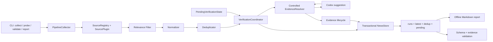

# mynews 系统架构与代码结构

## 架构目标

- CLI 只调用应用层，不编排来源、Codex 或文件写入。
- 来源、核验器、时钟、HTTP 和 Store 都位于可替换 seam。
- discovery 只负责发现；只有程序复核后的第一方证据才能产生 `verified`。
- 新闻去重与核验重试具有独立生命周期。
- RunReport JSON 是稳定外部 interface，内部 Python 结构不是外部契约。

## 数据流



## Module 与 seam

| Module | Interface | 责任边界 |
| --- | --- | --- |
| SourceRegistry | `collect_all`、`probe` | 隔离 Adapter、汇总健康状态，不决定 verified |
| Normalizer | `normalize` | URL、时间、语言、事件类型和稳定事件键 |
| Deduplicator | `deduplicate` | 新闻输出去重；不决定 pending 是否重试 |
| VerificationCoordinator | `verify(new_targets, now, config)` | 合并新目标与到期 pending，在内存中演进状态 |
| EvidenceResolver | `resolve`、`resolve_suggestion` | 固定解析顺序和程序二次校验 |
| EvidenceLifecycleReviewer | `review` | current、changed_supporting、failed 复核状态 |
| NewsStore | `commit(report, dedup_state, pending_state)` | 历史 run、latest、dedup、pending 的逻辑事务 |
| Validation | `validate_run_file` | 1.x Schema 和已保存证据复核 |

## 受控证据解析

解析顺序固定为：

1. 候选自身的官方 URL；
2. 候选页面中首个明确的第一方链接；
3. Codex 返回的结构化建议。

所有步骤使用相同的程序信任边界：

- 只接受 HTTPS；
- 官方域名必须精确匹配 host，不能做字符串后缀或相似名称匹配；
- GitHub 必须精确匹配组织路径首段；
- 候选页和证据页都不接受跨域重定向；
- 搜索页、媒体转述和不可访问页面不能成为证据；
- 摘录必须存在于可见正文；日期必须匹配；首次核验正文哈希必须匹配。

Codex 只提供候选 URL、日期、摘录和哈希建议。它不能增加域名、GitHub 组织或绕过程序校验。

## Pending 增量核验

`PendingVerificationState` 独立于 `DedupState`。可重试失败保存完整核验目标、尝试次数、最后原因、下次重试、上限和 TTL。

一次成功运行的顺序是：

1. 采集并过滤不相关 discovery；
2. 规范化并执行新闻去重；
3. 从 pending 取出到期目标；
4. 以 event key 合并新目标与 pending 目标；
5. 执行核验并只在内存中更新 pending；
6. 构造 RunReport；
7. 由 Store 一次提交 run、latest、dedup 和 pending。

来源整体失败时不执行步骤 3 至 7 中的状态演进，不增加 pending 尝试次数。

## 证据生命周期

首次证据使用严格哈希门槛。复核已保存证据时：

- `current`：页面规范化哈希未变化；
- `changed_supporting`：哈希变化，但原摘录、日期、官方边界和重定向仍有效；保存前一哈希并产生 warning；
- `failed`：不可访问、支持文本消失、日期不匹配或安全边界异常；条目必须降级为 unverified。

`changed_supporting` 不是放宽首次核验，它只适用于已经通过严格首次核验的证据。

## Store 事务

`JsonNewsStore.commit` 先在每个目标文件所在目录写临时文件、刷新并 `fsync`，然后执行替换。提交集合包括：

- `output/runs/<run-id>.json`；
- complete/partial 时的 `output/latest.json`；
- `state/dedup.json`；
- `state/pending_verifications.json`。

任一步骤失败时，Store 恢复提交前的文件内容，并删除本次新历史 run。failed Run 不覆盖 latest，也不推进 dedup 或 pending。

## 核心领域类型

- `CollectionRequest`：带时区的采集范围和实际核验预算。
- `Candidate`：Source Adapter 产生的未经规范化线索。
- `NewsItem`：规范化新闻事件、核验状态和报告事实。
- `Evidence`：第一方 URL、日期、摘录、当前哈希、前一哈希和生命周期校验。
- `PendingVerificationEntry`：可恢复核验目标和重试事实。
- `VerificationStats`：尝试、重试、pending、expired 和复核统计。
- `RunReport`：一次运行的完整 1.x JSON interface。

领域模型不依赖 Codex CLI、具体 HTTP 实现或文件系统。

## 代码结构

```text
src/mynews/
├── cli.py
├── application/
│   ├── collector.py
│   ├── verification.py
│   ├── evidence_review.py
│   ├── validation.py
│   └── report.py
├── domain/
│   ├── models.py
│   ├── normalization.py
│   ├── deduplication.py
│   └── relevance.py
├── sources/
│   ├── protocol.py
│   ├── registry.py
│   └── builtins/
├── verification/
│   ├── protocol.py
│   ├── codex.py
│   ├── resolver.py
│   ├── security.py
│   ├── pending.py
│   └── lifecycle.py
├── storage/
│   ├── protocol.py
│   └── json_store.py
└── infrastructure/
    ├── http.py
    └── clock.py
```

## 失败和安全规则

- 网页、模型输出和搜索结果都是不可信输入。
- 不绕过登录、付费墙、robots 或验证码。
- 不相关 discovery 在进入规范化和核验前停止。
- 任何没有完整第一方证据的路径都保持 unverified。
- stable 来源失败必须影响 Run 状态；experimental 来源按现有等级规则如实记录。
- 运行数据只写被忽略的 `output/`、`state/` 和 `logs/`。
- launchd 只能由用户显式操作；开发和 CI 不安装或加载真实任务。

重要变更见 [ADR-0001](../decisions/ADR-0001-strict-evidence-and-module-seams.md) 与 [ADR-0002](../decisions/ADR-0002-controlled-resolution-and-evidence-lifecycle.md)。
