# mynews 系统架构与代码结构

## 架构目标

- 调用者只需要理解 `collect` 和 `probe`，复杂度留在深 Module 内部。
- 来源、核验器和存储放在真实 seam 上，通过 Adapter 替换。
- 新增来源不修改 Collector 主流程。
- 热点、真实性和中文摘要彼此独立，避免一个模型判断决定全部结果。
- JSON interface 先于实现固定，为后续 UI、数据库或插件开发保留稳定输入。

## 系统数据流

```mermaid
flowchart LR
    CLI["CLI: collect / probe"] --> COL["Collector Module"]
    COL --> REG["Source Registry"]
    REG --> SRC["SourcePlugin Adapters"]
    SRC --> NOR["Normalize + Filter + Deduplicate"]
    NOR --> VER["EvidenceVerifier"]
    VER --> POST["First-party post-validation"]
    POST --> SUM["Chinese factual summary"]
    SUM --> STORE["NewsStore"]
    STORE --> JSON["Run JSON + latest + state"]
```



`Collector` 是应用层唯一主 Module。CLI 不编排来源、不拼 JSON、不直接调用 Codex。

## Module 与 interface

| Module | Interface | 隐藏的实现复杂度 |
| --- | --- | --- |
| Collector | 阶段 2 `SourceCollector.collect(request) -> SourceCollection`；阶段 3+ `collect(request) -> RunReport` | 阶段 2 原始来源编排；后续规范化、降级、归并、核验、提交 |
| SourceRegistry | `collect_all(context) -> SourceCollection`、`probe(...)` | 插件发现、隔离、超时和状态汇总 |
| Normalizer | `normalize(batch) -> tuple[NewsItem, ...]` | URL、日期、语言、来源角色、事件类型和稳定事件键 |
| EvidenceVerifier | `verify(candidates) -> VerificationBatch` | Codex 批次、Schema、超时、证据匹配 |
| NewsStore | `commit(report) -> StoredRun` | 原子写、latest、历史和状态快照 |

阶段 3 已实现 `Normalizer`、`Deduplicator`、`JsonNewsStore` 和 `PipelineCollector`；
阶段 4 通过 `EvidenceVerifier` 接入官方直验和 Codex 辅助核验。`PipelineCollector` 通过
阶段 2 的 `SourceCollector` 获取原始候选，再把规范化、跨运行去重、核验和 `RunReport`
提交保持在这些 seam 内。

测试通过这些 interface 观察结果，不依赖内部函数排列。

## 核心领域类型

- `CollectionRequest`：精确时间范围、时区、来源过滤和可选核验上限；未指定时由应用配置注入。
- `SourceMetadata`：稳定 ID、角色、地区、官方域名、稳定等级和能力。
- `Candidate`：原始标题、URL、时间、来源、热度信号、稳定的页面标题摘录和可选完整内容。
- `Evidence`：第一方 URL、发布者、日期、摘录、内容哈希和检索时间。
- `NewsItem`：规范化事件、中文事实摘要、核验状态和证据集合。
- `SourceResult`：来源状态、数量、耗时和结构化错误。
- `RunReport`：一次执行的完整可序列化结果。
- `PriceSnapshot`：官方价格页快照、规范化内容指纹、`first_observed_at` 和可选 `published_at`。
- `VerificationConfig`：Verifier 的模型、预算、批大小、超时和 Codex 可执行文件配置，不属于
  JSON 领域模型。

类型定义不依赖 httpx、feedparser、Codex CLI 或文件系统。

## SourcePlugin interface

v1 有多个来源 Adapter，因此来源 seam 是真实存在的。插件只负责“从一个来源正确地产生候选和健康状态”。

```python
class SourcePlugin(Protocol):
    metadata: SourceMetadata

    def collect(self, context: SourceContext) -> SourceBatch: ...
    def probe(self, context: ProbeContext) -> SourceHealth: ...
```

约束：

- 插件 ID 永久稳定，不从显示名称自动生成。
- 插件不得写 output/state，不得直接调用 Codex，不得决定最终 verified。
- 插件必须声明发布时间语义；不知道发布日期时返回 `None`，不能使用抓取时间冒充。
- 价格 Adapter 可在 `SourceBatch.price_snapshot` 返回快照，但不得自行写 `state`；只有
  Pipeline 发现已有快照且规范化 URL/内容哈希变化时，才生成 `pricing_change` 候选。
- 插件失败只影响自身，必须返回结构化错误。
- 所有网络调用使用注入的共享 HTTP client、Clock 和配置。
- 插件 fixture 测试与真实 probe 使用同一个 interface。

## 插件扩展策略

### 阶段 2 已实现的来源 seam

- `src/mynews/sources/protocol.py` 定义 `SourcePlugin`、`SourceContext`、`ProbeContext`、
  `SourceBatch`、`SourceCollection` 和 `SourceHealth`；`SourceBatch` 可携带价格快照，领域候选
  仍使用阶段 1 的 `Candidate`，不引入 Store 或核验依赖。
- `src/mynews/sources/registry.py` 只加载显式 built-in 插件，检查重复 ID，按 `--source` 选择，
  并在并发执行时将单个 Adapter 异常转换为自身的结构化健康错误。
- `src/mynews/infrastructure/http.py` 提供可注入的共享 HTTP client：超时、有限重试、User-Agent、
  并发上限和 ETag/Last-Modified 缓存协商集中在一个边界内。
- `SourceContext`/`ProbeContext` 同时注入 `Clock`；来源 metadata 声明 plugin API 版本、能力、
  地区、稳定等级和发布时间语义，registry 会拒绝不支持的协议版本或空能力声明。
- `official_pages.py` 提供 OpenAI、Anthropic、Google Gemini、DeepSeek、TRAE 的官方更新页，
  OpenAI/DeepSeek 的价格页，以及只读取公开元数据的知乎/Bloomberg 实验 Adapter。
- `SourceBlockedError` 将登录、付费墙或实验入口不可公开访问转换为 `blocked`；Adapter 不尝试
  绕过访问控制。`discovery` 候选保持 `unverified`，不会由来源直接决定真实性。
- 阶段 2 的原始 `SourceCollector` seam 输出候选与健康快照；生产 `PipelineCollector`/CLI
  `collect` 已接入 `RunReport`、规范化、跨运行去重、JSON Store 和阶段 4 核验。

### v1

- built-in 插件显式注册，配置通过稳定 `source_id` 启用。
- RSS/Atom、GitHub Release、API 和来源专用 HTML 可以共享内部实现，但不暴露额外公共 interface。
- Registry 检查重复 ID、配置版本和能力声明。

### 后续版本

- 当确实出现仓库外插件需求时，再用 Python entry points（建议组名 `mynews.sources`）加载。
- 对外发布前必须新增插件兼容性 ADR、契约测试套件和 `plugin_api_version`。
- 外部插件只获得 SourceContext 中明确提供的依赖，不读取 Collector 内部状态。
- 不保证 v1 内部 Protocol 已是稳定第三方 interface；避免过早冻结错误设计。

## 核验与存储 seam

- `EvidenceVerifier` 有 `CodexVerifier` 和测试用 `FakeVerifier` 两个 Adapter，公共方法为
  `verify(candidates, *, config) -> VerificationBatch`。
- `NewsStore` 有 `JsonNewsStore` 和测试用 `InMemoryNewsStore` 两个 Adapter。
- Codex 是不受控外部依赖：只读、ephemeral、结构化输出、固定超时、失败不升级真实性。
- 官方 HTML Adapter 将稳定页面标题作为逐字证据摘录、完整卡片文本保留在 `content`；核验时只在
  可见文本中做逐字匹配，忽略 HTML 标签、脚本内容和零宽格式字符；正文哈希也基于同一可见正文规范化结果，
  同时保持精确官方域名和日期规则。
- Codex 提示明确要求返回页面中逐字连续的原文片段和可见正文规范化哈希；模型改写、翻译、拼接或归因性
  转述仍会保持 `unverified`，并记录 `evidence_excerpt_mismatch`。
- Codex 模型、候选预算和批大小由配置注入，不在领域层或 Collector 中写死。
- `SourceMetadata.official_domains` 采用精确主机名匹配；GitHub URL 还必须匹配声明的组织，
  不能用形似官方名称的子域名替代。
- Storage 接收完整 `RunReport`，不知道来源抓取细节。
- `application/validation.py` 提供发布前校验 seam：离线检查 RunReport/同源 Schema；显式传入
  `--check-evidence` 时复用 CodexVerifier 的程序二次校验逐条重抓已保存的第一方证据。

## 计划代码结构

```text
src/mynews/
├── cli.py
├── application/
│   ├── collector.py
│   └── validation.py
├── domain/
│   ├── models.py
│   ├── normalization.py
│   ├── deduplication.py
│   └── policies.py
├── sources/
│   ├── protocol.py
│   ├── registry.py
│   ├── cc_switch.py
│   └── builtins/
│       ├── official_pages.py
│       ├── hacker_news.py
│       ├── feed.py
│       ├── github_releases.py
│       └── ...
├── verification/
│   ├── protocol.py
│   ├── codex.py
│   └── evidence_policy.py
├── storage/
│   ├── protocol.py
│   └── json_store.py
└── infrastructure/
    ├── http.py
    └── clock.py
```

避免建立含义模糊的 `utils/`、`helpers/`、`managers/` 或每层只转发一次的目录。函数超过可读范围时按领域行为拆分，不按技术名词堆层。

## 失败和安全规则

- 网页内容是不可信输入，不允许页面文本改变系统提示或执行命令。
- URL 规范化后仍要验证协议、官方域名、重定向目标和 GitHub 组织。
- 禁止绕过验证码、付费墙和 robots；来源状态如实标为 blocked。
- 全部来源失败时写失败诊断但不更新 latest；部分失败返回可用 report 和退出码 3。
- 价格页只有差异证据和 first_observed_at，没有官方日期就不推断。

## 架构演进门槛

以下变化必须新增或更新 ADR：

- 修改 verified 的定义。
- 发布外部插件 interface 或做不兼容升级。
- JSON 主版本升级。
- JSON Store 之外引入数据库并改变写入语义。
- 将 Codex 从辅助核验改成唯一判断者。
