# mynews 系统架构与代码结构

## 架构目标

- 调用者只需要理解 `collect` 和 `probe`，复杂度留在深 Module 内部。
- 来源、核验器和存储放在真实 seam 上，通过 Adapter 替换。
- 新增来源不修改 Collector 主流程。
- 热点、真实性和中文摘要彼此独立，避免一个模型判断决定全部结果。
- JSON interface 先于实现固定，为后续 UI、数据库或插件开发保留稳定输入。

## 系统数据流

```mermaid
flowchart LR
    CLI["CLI: collect / probe"] --> COL["Collector Module"]
    COL --> REG["Source Registry"]
    REG --> SRC["SourcePlugin Adapters"]
    SRC --> NOR["Normalize + Filter + Deduplicate"]
    NOR --> VER["EvidenceVerifier"]
    VER --> POST["First-party post-validation"]
    POST --> SUM["Chinese factual summary"]
    SUM --> STORE["NewsStore"]
    STORE --> JSON["Run JSON + latest + state"]
```



`Collector` 是应用层唯一主 Module。CLI 不编排来源、不拼 JSON、不直接调用 Codex。

## Module 与 interface

| Module | Interface | 隐藏的实现复杂度 |
| --- | --- | --- |
| Collector | `collect(request) -> RunReport` | 来源并发、降级、归并、核验、提交 |
| SourceRegistry | `collect_all(context) -> SourceCollection`、`probe(...)` | 插件发现、隔离、超时和状态汇总 |
| Normalizer | `normalize(batch) -> CandidateSet` | URL、日期、语言、事件键和去重 |
| EvidenceVerifier | `verify(candidates) -> VerificationBatch` | Codex 批次、Schema、超时、证据匹配 |
| NewsStore | `commit(report) -> StoredRun` | 原子写、latest、历史和状态快照 |

测试通过这些 interface 观察结果，不依赖内部函数排列。

## 核心领域类型

- `CollectionRequest`：精确时间范围、时区、来源过滤和核验上限。
- `SourceMetadata`：稳定 ID、角色、地区、官方域名、稳定等级和能力。
- `Candidate`：原始标题、URL、时间、来源、热度信号和原始摘录。
- `Evidence`：第一方 URL、发布者、日期、摘录、内容哈希和检索时间。
- `NewsItem`：规范化事件、中文事实摘要、核验状态和证据集合。
- `SourceResult`：来源状态、数量、耗时和结构化错误。
- `RunReport`：一次执行的完整可序列化结果。

类型定义不依赖 httpx、feedparser、Codex CLI 或文件系统。

## SourcePlugin interface

v1 有多个来源 Adapter，因此来源 seam 是真实存在的。插件只负责“从一个来源正确地产生候选和健康状态”。

```python
class SourcePlugin(Protocol):
    metadata: SourceMetadata

    def collect(self, context: SourceContext) -> SourceBatch: ...
    def probe(self, context: ProbeContext) -> SourceHealth: ...
```

约束：

- 插件 ID 永久稳定，不从显示名称自动生成。
- 插件不得写 output/state，不得直接调用 Codex，不得决定最终 verified。
- 插件必须声明发布时间语义；不知道发布日期时返回 `None`，不能使用抓取时间冒充。
- 插件失败只影响自身，必须返回结构化错误。
- 所有网络调用使用注入的共享 HTTP client、Clock 和配置。
- 插件 fixture 测试与真实 probe 使用同一个 interface。

## 插件扩展策略

### 阶段 2 已实现的来源 seam

- `src/mynews/sources/protocol.py` 定义 `SourcePlugin`、`SourceContext`、`ProbeContext`、
  `SourceBatch` 和 `SourceHealth`；领域候选仍使用阶段 1 的 `Candidate`，不引入 Store 或核验依赖。
- `src/mynews/sources/registry.py` 只加载显式 built-in 插件，检查重复 ID，按 `--source` 选择，
  并在并发执行时将单个 Adapter 异常转换为自身的结构化健康错误。
- `src/mynews/infrastructure/http.py` 提供可注入的共享 HTTP client：超时、有限重试、User-Agent、
  并发上限和 ETag/Last-Modified 缓存协商集中在一个边界内。
- `SourceContext`/`ProbeContext` 同时注入 `Clock`；来源 metadata 声明 plugin API 版本、能力、
  地区、稳定等级和发布时间语义，registry 会拒绝不支持的协议版本或空能力声明。
- 阶段 2 CLI 输出的是原始候选与健康快照；它不是 `RunReport`，不写 `output/`，不做规范化、
  去重、第一方核验或 JSON Store。

### v1

- built-in 插件显式注册，配置通过稳定 `source_id` 启用。
- RSS/Atom、GitHub Release、API 和来源专用 HTML 可以共享内部实现，但不暴露额外公共 interface。
- Registry 检查重复 ID、配置版本和能力声明。

### 后续版本

- 当确实出现仓库外插件需求时，再用 Python entry points（建议组名 `mynews.sources`）加载。
- 对外发布前必须新增插件兼容性 ADR、契约测试套件和 `plugin_api_version`。
- 外部插件只获得 SourceContext 中明确提供的依赖，不读取 Collector 内部状态。
- 不保证 v1 内部 Protocol 已是稳定第三方 interface；避免过早冻结错误设计。

## 核验与存储 seam

- `EvidenceVerifier` 有 `CodexVerifier` 和测试用 `FakeVerifier` 两个 Adapter。
- `NewsStore` 有 `JsonNewsStore` 和测试用 `InMemoryNewsStore` 两个 Adapter。
- Codex 是不受控外部依赖：只读、ephemeral、结构化输出、固定超时、失败不升级真实性。
- Codex 模型、候选预算和批大小由配置注入，不在领域层或 Collector 中写死。
- Storage 接收完整 `RunReport`，不知道来源抓取细节。

## 计划代码结构

```text
src/mynews/
├── cli.py
├── application/
│   └── collector.py
├── domain/
│   ├── models.py
│   ├── normalization.py
│   ├── deduplication.py
│   └── policies.py
├── sources/
│   ├── protocol.py
│   ├── registry.py
│   ├── cc_switch.py
│   └── builtins/
│       ├── hacker_news.py
│       ├── feed.py
│       ├── github_releases.py
│       └── ...
├── verification/
│   ├── protocol.py
│   ├── codex.py
│   └── evidence_policy.py
├── storage/
│   ├── protocol.py
│   └── json_store.py
└── infrastructure/
    ├── http.py
    └── clock.py
```

避免建立含义模糊的 `utils/`、`helpers/`、`managers/` 或每层只转发一次的目录。函数超过可读范围时按领域行为拆分，不按技术名词堆层。

## 失败和安全规则

- 网页内容是不可信输入，不允许页面文本改变系统提示或执行命令。
- URL 规范化后仍要验证协议、官方域名、重定向目标和 GitHub 组织。
- 禁止绕过验证码、付费墙和 robots；来源状态如实标为 blocked。
- 全部来源失败时写失败诊断但不更新 latest；部分失败返回可用 report 和退出码 3。
- 价格页只有差异证据和 first_observed_at，没有官方日期就不推断。

## 架构演进门槛

以下变化必须新增或更新 ADR：

- 修改 verified 的定义。
- 发布外部插件 interface 或做不兼容升级。
- JSON 主版本升级。
- JSON Store 之外引入数据库并改变写入语义。
- 将 Codex 从辅助核验改成唯一判断者。
