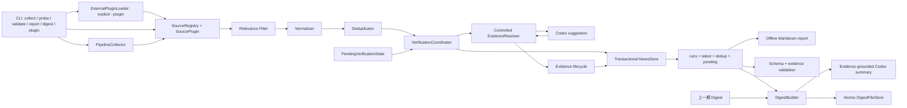

# mynews 系统架构与代码结构

## 架构目标

- CLI 只调用应用层，不编排来源、Codex 或文件写入。
- 来源、核验器、时钟、HTTP 和 Store 都位于可替换 seam。
- discovery 只负责发现；只有程序复核后的第一方证据才能产生 `verified`。
- 新闻去重与核验重试具有独立生命周期。
- RunReport JSON 是稳定外部 interface，内部 Python 结构不是外部契约。
- DigestBuilder 只读取已保存事实和上一期 Digest，不回写采集、核验或 pending 状态。

## 数据流



## Module 与 seam

| Module | Interface | 责任边界 |
| --- | --- | --- |
| SourceRegistry | `collect_all`、`probe` | 隔离 Adapter、汇总健康状态，不决定 verified |
| ExternalPluginLoader | `list_report`、`load(plugin_ids)` | 发现 `mynews.source_plugins`，显式加载无参数工厂，严格校验 metadata 和 source_id；不接触 Store/Verifier/Codex |
| Normalizer | `normalize` | URL、时间、语言、事件类型和稳定事件键 |
| Deduplicator | `deduplicate` | 新闻输出去重；不决定 pending 是否重试 |
| VerificationCoordinator | `verify(new_targets, now, config)` | 合并新目标与到期 pending，在内存中演进状态 |
| EvidenceResolver | `resolve`、`resolve_suggestion` | 固定解析顺序和程序二次校验 |
| EvidenceLifecycleReviewer | `review` | current、changed_supporting、failed 复核状态 |
| NewsStore | `commit(report, dedup_state, pending_state)` | 历史 run、latest、dedup、pending 的逻辑事务 |
| Validation | `validate_run_file` | 1.x Schema 和已保存证据复核 |
| DigestBuilder | `build(report, previous, config)` | 保守事件聚合、确定性排序、生命周期与主榜/线索隔离；不改变 RunReport |
| DigestSummaryRunner | `run(prompt, model, timeout, reasoning_effort)` | 只读取已保存证据的可替换摘要调用；非法输出只能触发安全回退 |
| DigestFileStore | `load_latest`、`write` | 历史 Digest、latest JSON 和 Markdown 的同批次原子提交 |

外部插件的 entry-point 名称是 CLI 的插件 ID；只有 `--plugin` 选择才执行工厂，
`plugin list` 只读取分发元数据。通过校验的插件使用 `SourceRegistry.with_plugins` 与
内置来源共享既有 collect/probe 隔离和 RunReport 1.x 结构。插件是受信任的本地 Python
代码，显式允许清单不是进程级沙箱；不开放核验器插件。

### v1.5 Proposed 扩展 seam

以下边界仅为 [v1.5 当前计划](../planning/v1.5-expanded-sources-safe-handoff-plan.md) 的
Proposed 设计，尚未实现：

- `ExternalPluginLoader` 和 SourcePlugin 1.0 协议保持不变；新增 `--with-plugin` 只在
  CLI 应用层把显式插件追加到 built-in 选择，普通 collect/probe 仍不加载插件。
- 既有 `--plugin` 继续表示 plugin-only，不能与 `--source` 或 `--with-plugin` 混用。
- 主 wheel 提供不含来源配置的通用 RSS/Atom 插件辅助接口；15 个来源及 entry-point
  位于独立分发包，不进入主 wheel，也不能接触 Store、Verifier 或 Codex。
- `research`、`incident`、`benchmark` 只扩展来源角色与筛选语义，不放宽第一方证据和
  `verified` 门槛；准确来源清单以[信息来源目录](../reference/source-catalog.md)为准。

Digest 的信任边界：只有 RunReport 中严格保存的 `primary_evidence` 可以形成 `evidence_refs`；Codex 不能增加 URL、事实或引用。主榜只接收 `verified`，线索观察只接收 `unverified`，两类输出在 Pydantic Schema 和 Markdown 渲染层同时隔离。

Digest 排序使用整数化的 35/25/20/20 权重：`relevance_score`、`heat_score`、时效分和固定事件类型分。相同分数按发布时间再按 `event_key` 稳定排序。聚合要求精确事件键/URL，或同时满足事件类型、共同实体、标题相似度和日期距离；不会因为同一厂商或相同事件类型单独合并。

## 受控证据解析

解析顺序固定为：

1. 候选自身的官方 URL；
2. 候选页面中首个明确的第一方链接；
3. Codex 返回的结构化建议。

所有步骤使用相同的程序信任边界：

- 只接受 HTTPS；
- 官方域名必须精确匹配 host，不能做字符串后缀或相似名称匹配；
- GitHub 必须精确匹配组织路径首段；
- 候选页和证据页都不接受跨域重定向；
- 搜索页、媒体转述和不可访问页面不能成为证据；
- 摘录必须存在于可见正文；日期必须匹配；首次核验正文哈希必须匹配。

Codex 只提供候选 URL、日期、摘录和哈希建议。它不能增加域名、GitHub 组织或绕过程序校验。

## Pending 增量核验

`PendingVerificationState` 独立于 `DedupState`。可重试失败保存完整核验目标、尝试次数、最后原因、下次重试、上限和 TTL。

一次成功运行的顺序是：

1. 采集并过滤不相关 discovery；
2. 规范化并执行新闻去重；
3. 从 pending 取出到期目标；
4. 以 event key 合并新目标与 pending 目标；
5. 执行核验并只在内存中更新 pending；
6. 构造 RunReport；
7. 由 Store 一次提交 run、latest、dedup 和 pending。

来源整体失败时不执行步骤 3 至 7 中的状态演进，不增加 pending 尝试次数。

## 证据生命周期

首次证据使用严格哈希门槛。复核已保存证据时：

- `current`：页面规范化哈希未变化；
- `changed_supporting`：哈希变化，但原摘录、日期、官方边界和重定向仍有效；保存前一哈希并产生 warning；
- `failed`：不可访问、支持文本消失、日期不匹配或安全边界异常；条目必须降级为 unverified。

`changed_supporting` 不是放宽首次核验，它只适用于已经通过严格首次核验的证据。

## Store 事务

`JsonNewsStore.commit` 先在每个目标文件所在目录写临时文件、刷新并 `fsync`，然后执行替换。提交集合包括：

- `output/runs/<run-id>.json`；
- complete/partial 时的 `output/latest.json`；
- `state/dedup.json`；
- `state/pending_verifications.json`。

任一步骤失败时，Store 恢复提交前的文件内容，并删除本次新历史 run。failed Run 不覆盖 latest，也不推进 dedup 或 pending。

## 核心领域类型

- `CollectionRequest`：带时区的采集范围和实际核验预算。
- `Candidate`：Source Adapter 产生的未经规范化线索。
- `NewsItem`：规范化新闻事件、核验状态和报告事实。
- `Evidence`：第一方 URL、日期、摘录、当前哈希、前一哈希和生命周期校验。
- `PendingVerificationEntry`：可恢复核验目标和重试事实。
- `VerificationStats`：尝试、重试、pending、expired 和复核统计。
- `RunReport`：一次运行的完整 1.x JSON interface。
- `Digest`：独立 Schema 1.0 的主榜、线索观察、摘要状态、生命周期和证据引用。

领域模型不依赖 Codex CLI、具体 HTTP 实现或文件系统。

## 代码结构

```text
src/mynews/
├── cli.py
├── application/
│   ├── collector.py
│   ├── verification.py
│   ├── evidence_review.py
│   ├── validation.py
│   ├── digest.py
│   └── report.py
├── domain/
│   ├── models.py
│   ├── normalization.py
│   ├── deduplication.py
│   └── relevance.py
├── sources/
│   ├── protocol.py
│   ├── registry.py
│   ├── external.py
│   └── builtins/
├── verification/
│   ├── protocol.py
│   ├── codex.py
│   ├── resolver.py
│   ├── security.py
│   ├── pending.py
│   └── lifecycle.py
├── storage/
│   ├── protocol.py
│   ├── json_store.py
│   └── digest_store.py
└── infrastructure/
    ├── http.py
    └── clock.py
```

## 失败和安全规则

- 网页、模型输出和搜索结果都是不可信输入。
- 不绕过登录、付费墙、robots 或验证码。
- 不相关 discovery 在进入规范化和核验前停止。
- 任何没有完整第一方证据的路径都保持 unverified。
- stable 来源失败必须影响 Run 状态；experimental 来源按现有等级规则如实记录。
- 外部插件加载失败时不启动流水线；插件运行异常只形成结构化来源失败，failed Run 不覆盖 latest、dedup、pending 或已有历史 run。
- 运行数据只写被忽略的 `output/`、`state/` 和 `logs/`。
- Digest 输出失败时恢复旧 `digest-latest.json`/`.md`，不留下临时文件；摘要模型失败时状态为 `partial` 并回退到标题和已保存证据摘录。
- Digest 在调用 Codex 前检查不可信标题/摘录中的提示注入标记；模型摘要或影响判断出现同类标记时拒绝其结果并以不回显可疑摘录的 `partial` 回退。
- 核验和摘要的 Codex 推理强度由各自 CLI 参数配置，默认 `medium`；该运行时选项不改变 verified、第一方证据或安全回退门槛。
- launchd 只能由用户显式操作；开发和 CI 不安装或加载真实任务。

重要变更见 [ADR-0001](../decisions/ADR-0001-strict-evidence-and-module-seams.md)、[ADR-0002](../decisions/ADR-0002-controlled-resolution-and-evidence-lifecycle.md) 与 [ADR-0003](../decisions/ADR-0003-evidence-grounded-intelligence-digest.md)。
