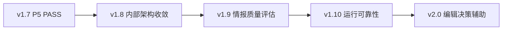

# mynews v1.8-v2.0 产品与技术路线图

## 文档定位

本文把 v1.7 之后可能推进的内部架构、情报质量、运行可靠性和编辑辅助工作整理为阶段路线图。
规划审查基线为 `codex/architecture-direction-review` 的 `a8fd51e`；该提交尚未合入本地 `main`，
因此这里只记录候选顺序，不是未来阶段的实施基线。

本文状态为 **Draft / Proposed**：

- 不替代唯一 Current 计划 [v1.7 分时情报分析与人工反馈闭环计划](v1.7-intelligence-loop-plan.md)；
- 不授权 P5 真实任务、真实网络 probe、Scheduled Task 注册或故障演练；
- 不代表 v1.8、v1.9、v1.10 或 v2.0 已经进入开发；
- 每个版本必须在前置门禁完成后，单独形成 Current 实施计划；
- 路线图与 [架构方向审查](../../../architecture/architecture-direction-review-2026-08-20.md) 冲突时，
  先重新审查事实，不直接扩大范围。

## 当前基线

截至本路线图创建时：

- v1.6 的 newsFromAI `datacollection` 能力吸收已按 Implemented 归档，不存在新的 parity 开发缺口；
- v1.7 P0-P4 已按 Implemented 落地；
- v1.7 P5 真实双档、`latest_only` 和失败恢复尚未执行，当前为
  `SKIPPED（待单独授权）`，不是 Verified；
- 架构审查已识别 CLI 编排、文件提交重复、Candidate Contract、Codex 进程 Adapter 和
  prompt-first 任务 runner 五类候选问题；
- 当前没有证据要求新增来源、修改 Candidate/Digest Schema、引入 SQLite 或自动发布能力。

## 路线图激活门禁

只有同时满足以下条件，才能把 v1.8 从 Draft 提升为 Current：

1. 当前架构方向审查与本路线图经确认并合入最新本地 `main`；
2. v1.7 P5 按 Current 计划完成真实验收并取得 `PASS`；
3. P5 证据已经回写，v1.7 完成收口并归档；
4. 最新 `main` 工作树干净，包含上一阶段全部交付；
5. 为 v1.8 创建新的 Current 实施计划和 `codex/v1.8-...` 分支；
6. v1.8 计划重新核对代码位置、测试数量、Codex CLI 行为和真实运行限制。

若 P5 为 `BLOCKED` 或 `FAIL`，本路线图继续保持 Draft，不启动 ARCH-01、ARCH-02 或后续版本。
外部阻断解除后先恢复 P5；程序失败先在独立修复分支处理并重新验收。

## 跨版本不变量

以下约束贯穿所有阶段，除非新增替代 ADR 并完成兼容设计：

- discovery、Candidate、人工清单、媒体和模型输出不能直接产生 `verified`；
- 只有程序复核后的第一方证据可以进入 Digest `main_items` 和正式情报；
- DedupState 与 PendingVerificationState 保持独立生命周期；
- SourcePlugin 只负责来源，不接触 Store、Verifier、Codex 或修改 `verified`；
- Digest 只读取已保存 RunReport 和上一期 Digest，不重新采集或推进核验；
- failed run 不覆盖 latest，报告成功后才能推进自动化成功状态；
- publication ledger 与 weekly feedback 只记录人工事实，不自动发布；
- 默认保持 CLI、JSON、SourcePlugin 和文件路径向后兼容；
- 运行产物只写 `output/`、`state/` 和 `logs/`，不提交到 Git；
- 离线检查最高证明 Implemented，真实网络、Codex、恢复和调度必须单独验证。

## 阶段总览

| 版本 | 主题 | 核心结果 | 启动条件 | 最高状态条件 |
| --- | --- | --- | --- | --- |
| v1.8 | 内部架构收敛 | CLI 薄化、文件提交机制收敛 | v1.7 P5 PASS 且归档 | 离线门禁通过为 Implemented |
| v1.9 | 情报质量评估 | 固定样本、可重复指标和离线评估报告 | v1.8 合入并稳定 | 真实样本评估后才能 Verified |
| v1.10 | 运行可靠性 | 健康趋势、保留恢复和诊断证据 | v1.9 基线可用 | 真实恢复演练后才能 Verified |
| v2.0 | 编辑决策辅助 | 周复盘、重复选题提示和只读建议 | 累积足够人工反馈 | 真实人工使用验收后才能 Verified |

推荐顺序：



## v1.8：内部架构收敛

### 目标

在不改变用户可见行为的前提下，优先解决两项高 leverage 设计债务：

1. **ARCH-01 CLI 薄化**：把插件选择、依赖装配、use case 调用和结构化结果移入应用层的深
   module；CLI 只处理参数解析、中文显示和退出码；
2. **ARCH-02 文件提交收敛**：统一 staging、`fsync`、替换、恢复和 `.tmp` 清理机制，Store、
   Prepare 和 Automation 继续拥有各自的提交集合与顺序。

### 建议工作包

| 工作包 | 范围 | 关键完成条件 |
| --- | --- | --- |
| v1.8-A | ARCH-01 interface 设计与 CLI 薄化 | 至少比较两种 interface；删除 CLI 中具体 Store/Codex/插件装配；行为兼容 |
| v1.8-B | ARCH-02 artifact commit 收敛 | 删除重复 OS 写入私有实现；单文件、批次回滚、报告先于状态分别保留 |
| v1.8-C | 条件性整理 | 只有真实维护需求出现时才评估 Candidate Contract 或共享 Codex Adapter |

v1.8-A 与 v1.8-B 不并行开发。v1.8-A 合入最新 `main` 后，v1.8-B 才从新的 `main` HEAD 创建
分支。v1.8-C 默认不启动，不能为了减少文件行数扩大范围。

### 接口与兼容

- 不新增或删除 CLI 命令、参数和退出码；
- 不改变 RunReport、Candidate、Digest 或 automation state Schema；
- 不改变 built-in、plugin-only 和 `--with-plugin` 选择语义；
- 不改变 verified、pending、Digest 主榜和失败状态规则；
- 不引入生产依赖，不引入 SQLite，不更换输出目录；
- 允许内部 Python module 和私有 helper 调整，但必须通过 deletion test。

### 验收门槛

- 现有 CLI、来源、插件、核验、Digest、Prepare、publication 和 feedback 测试全部通过；
- 为应用入口和文件提交的失败恢复补充针对性测试；
- `git diff --check`、文档检查、Ruff、Mypy、全量测试和中文 CLI help 通过；
- failed run、Digest 回滚、Prepare 回滚、报告先于状态和无 `.tmp` 残留保持不变；
- 代码移动或重构不把 P5 历史证据重新解释为 Verified。

### 停止条件

- 需要改变公共 CLI、JSON 或插件协议；
- 无法删除旧装配或重复写入实现，只能增加中间层；
- 文件提交统一后无法证明原有三种业务语义等价；
- v1.7 P5 尚未 PASS 或最新 `main` 未包含上一阶段交付。

## v1.9：情报质量评估

### 目标

建立可重复、可离线运行的情报质量评估体系，回答“收集和整理结果是否稳定变好”，而不只证明
程序能够运行。评估结果只生成报告，不自动修改来源、权重、`verified` 或 Digest 排名。

### 规划范围

1. 建立经过人工标注的固定评估样本，覆盖官方直达、discovery、可重试失败、同事件多来源、
   相似但不同事件、价格变化、提示注入和证据漂移；
2. 样本只保存测试所需的脱敏、可再分发内容，不把临时搜索摘要或受限正文当作事实；
3. 定义可重复指标：
   - 固定样本上的候选覆盖率；
   - verified 正确性与错误升级数；
   - 事件误合并和漏合并数；
   - pending 终止原因与重试演进正确性；
   - Digest 主榜/线索隔离错误数；
   - 相同输入的排序、生命周期和报告稳定性；
4. 输出机器可读结果和简短中文评估报告，记录基线提交、样本版本和未执行项；
5. 真实样本只作为独立验收，不进入普通离线测试，也不保存秘密或受限内容。

### 非目标

- 不用单一“综合分”掩盖 verified 错误；
- 不承诺无法定义真实分母的全网漏收率；
- 不根据一次评估自动禁用来源、修改权重或放宽证据门槛；
- 不新增来源，不训练模型，不把模型裁判当作唯一标签；
- 不把 fixture 通过写成真实网络 Verified。

### 验收门槛

- 评估样本、期望标签和指标公式版本化且可审查；
- 同一提交与样本重复运行结果一致；
- 至少覆盖 verified 错误升级、事件误合并和事实/线索污染三个零容忍类别；
- 指标失败以非零退出或结构化失败呈现，不静默跳过；
- 真实样本验收记录来源、时间、输入、结果和限制，不能由离线 fixture 代替。

## v1.10：运行可靠性

### 目标

在不增加新的调度体系前，利用已保存的 RunReport、Digest、任务报告和来源健康结果，建立运行
趋势、数据保留与恢复演练，使“某次成功”升级为“长期可诊断、可恢复”。

### 规划范围

- 汇总每个来源的 healthy、partial、blocked、failed 和空结果趋势，但不自动修改来源配置；
- 区分来源失败、网络限制、Codex 失败、证据不足和存储失败；
- 为 runs、digests、editorial reports 和必要 state 制定保留、归档和恢复规则；
- 设计只读诊断报告，显示最后成功档位、连续失败、陈旧输出和待处理 pending；
- 在隔离目录执行备份与恢复演练，证明 latest、历史、dedup、pending 和 automation state 一致；
- 在积累真实基线后再讨论可靠性目标，不预先编造成功率或延迟百分比。

### 非目标

- 不自动重启、自动注册任务或操作旧 09:30 launchd；
- 不自动删除历史数据，保留策略实施前必须有可恢复副本和用户确认；
- 不把 `blocked` 来源伪装成 healthy，不用空 Feed 代替成功内容；
- 不把运维汇总写回 Candidate、RunReport 或 Digest 事实字段。

### 验收门槛

- 离线故障注入证明诊断分类、旧输出保护和恢复顺序；
- 真实恢复演练使用隔离副本，不破坏生产运行目录；
- 恢复后 Schema、引用路径、latest 与历史关系、dedup/pending 状态一致；
- 运行报告不包含密钥、Cookie、授权头、个人绝对路径或未脱敏正文；
- 没有真实恢复演练时最高为 Implemented，不能标记 Verified。

## v2.0：编辑决策辅助

### 目标

只读使用 Candidate、Digest、publication ledger 和 weekly feedback，生成可供作者判断的周复盘、
主题表现、重复选题提示和下一周期选题建议。系统提供依据，不代替作者发布或修改事实状态。

### 启动门禁

- publication ledger 与 weekly feedback 已积累足够的真实人工记录，可支持有意义的回顾；
- v1.9 质量评估能够区分事实、线索和不确定性；
- v1.10 已证明输入文件可诊断、可恢复；
- 用户单独确认需要编辑辅助，而不是自动发布或平台素材生成。

### 规划范围

- 按主题、平台和时间汇总阅读、收藏、转发、新增关注等人工记录；
- 提示已经发布或近期重复出现的事件，引用 Candidate event ID 和 ledger 事实；
- 区分“事实已核验但未发布”“待核查线索”“已发布后发生实质变化”；
- 生成周复盘和选题建议时附输入范围、缺失数据和判断理由；
- 结果只写新的只读分析产物，不回写 publication ledger、weekly feedback 或 `verified`。

### 非目标

- 不自动发布、自动填写平台表单或代表作者做最终选题；
- 不生成 PPT、小红书图片、Canva、TTS 或视频；
- 不把阅读量高解释为事实可靠，不用反馈指标改变证据门槛；
- 不采集未获授权的个人数据，不把平台 Cookie 或私密统计写入可分享输出；
- 不在数据量不足时伪造趋势或强行给出排名。

### 验收门槛

- 相同输入生成确定性统计，缺失字段和空数据有明确结果；
- 所有建议可追溯到 Candidate、Digest、ledger 或 feedback 的已保存输入；
- 事实、线索、人工反馈和模型建议在输出中明确分层；
- 输入只读、输出原子写入、失败不覆盖旧分析；
- 真实作者完成至少一次人工复核后，才讨论 Verified。

## 常规来源维护轨道

来源维护不单独作为新版本扩张阶段，而是贯穿路线图的受控工作：

- 定期复核现有 source_id、entry-point 安装、官方边界、Feed 可达性和空 Feed 语义；
- 来源长期失败时先记录证据和影响，再提出降级、替换或移除计划；
- 新来源必须有明确覆盖缺口、角色、第一方边界和插件加载方式；
- 普通 collect/probe 的默认行为保持稳定，外部插件继续显式选择；
- 来源维护不得与架构重构混在同一提交或同一验收结论中。

## 条件性候选

### Candidate Contract 深化

只有出现 Candidate v1 字段、兼容读取或 Schema 维护需求时，才将 ARCH-03 转为独立设计。目标是
消除 Pydantic、手写 Schema 和过程式校验的重复真相，不借机发布 Candidate v2。

### 共享 Codex 进程 Adapter

只有 Codex CLI 参数、Schema 文件或结构化执行方式需要变化时，才将 ARCH-04 纳入当前阶段。
共享基础进程执行，不合并核验与 Digest 的 prompt、响应模型和程序复核。

### 确定性任务 runner

只有 P5 真实证据显示 prompt-first 在档位选择、`latest_only`、步骤顺序或恢复上出现重复偏差，
才规划 ARCH-05。若提示运行稳定，继续使用 `news-task.md`，不新增 runner。

## 暂不规划

- newsFromAI 在 2026-08-11 后增加的 SQLite、PPT、小红书和 Canva；
- 自动发布、平台登录、付费墙或访问控制绕过；
- 无真实需求的 Web 控制台、数据库迁移、微服务拆分或新调度框架；
- 为追求数量继续批量新增来源；
- 用生成式模型替代程序证据校验、人工标签或作者最终判断；
- 在没有测量基线前承诺性能、覆盖率、成功率或响应时间目标。

## 阶段推进与分支规则

每个阶段必须执行以下流程：

1. 前一阶段完成验收并合入本地 `main`；
2. 从最新 `main` 创建新的 `codex/<phase>` 分支；
3. 将该阶段的 Draft 细化为唯一 Current 实施计划；
4. 先做只读首验，再独立开发或修复，再完整复验；
5. 通过离线门禁只能写 Implemented，真实门禁另行记录；
6. 阶段完成后先合入 `main`，下一阶段不得从旧分支继续；
7. 不自动 push，不操作真实任务、launchd 或运行台账，除非另有明确授权。

建议的未来分支只表示命名方向，实际创建时必须重新核对最新 `main`：

| 阶段 | 候选分支 |
| --- | --- |
| v1.8-A | `codex/v1.8-application-runtime` |
| v1.8-B | `codex/v1.8-artifact-commit` |
| v1.9 | `codex/v1.9-quality-evaluation` |
| v1.10 | `codex/v1.10-runtime-reliability` |
| v2.0 | `codex/v2.0-editorial-assistance` |

## 每阶段统一验收

每个阶段至少执行：

```bash
python3 scripts/check_docs.py
git diff --check
uv run ruff check .
uv run mypy src
uv run pytest -q
uv run mynews --help
```

并按变更范围补充：

- CLI 或 JSON 兼容测试；
- 来源/plugin-only/追加模式和逐来源 probe；
- verified、pending、Digest 主榜/线索隔离；
- 原子提交、失败恢复、旧输出保护和 `.tmp` 清理；
- 隐私门禁、无网络副作用或真实网络门禁；
- 实际执行项、退出码、固定提交、日期、环境和剩余限制。

未执行项必须写 `SKIPPED` 并说明原因。外部环境阻断写 `BLOCKED`；程序或契约错误写 `FAIL`。

## 路线图成功条件

本路线图不是以“所有版本一次性完成”为成功，而是以每个阶段都能独立停止、验证和回退为成功：

- v1.8 降低装配与文件提交的修改扩散，不改变外部行为；
- v1.9 让质量变化可重复测量，不用主观印象代替证据；
- v1.10 让长期运行可诊断、可恢复，不以一次成功代替可靠性；
- v2.0 让人工反馈产生可追溯建议，但不越过事实与发布边界；
- 任一阶段缺少真实需求、输入或验收环境时可以停止，不为版本号强行开发。

## 待确认决策

以下内容保留到对应阶段，不在路线图中提前冻结：

1. v1.8 应用入口的具体 interface 和结果对象；
2. artifact commit module 的错误类型和失败注入方式；
3. v1.9 评估样本规模、许可方式和指标阈值；
4. v1.10 数据保留周期、备份介质和恢复目标；
5. v2.0 周复盘格式、统计窗口和建议展示方式；
6. ARCH-03、ARCH-04、ARCH-05 是否获得真实触发条件。

这些决策必须由当前代码、真实运行证据和用户需求驱动，不能从本路线图直接推断为已批准设计。
